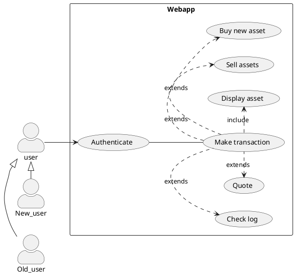

---
puppeteer:
    landscape: true
    format: "letter"
    timeout: 3000 # <= wait 3 seconds before rendering in browser
---
# UML: Use Case Diagram

Generate use case diagram via plant url for mockup-trading website.

## Overview

Web app untuk melihat interaksi aset over time tanpa memikirkan resiko tambahan dengan data realtime yang akan terupdate setiap waktu

