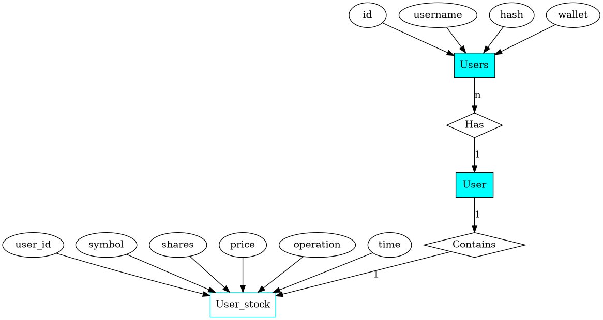
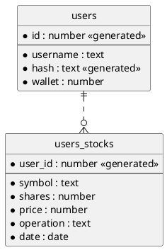

---
puppeteer:
    landscape: true
    format: "letter"
    timeout: 3000 # <= wait 3 seconds before rendering in browser
---

# Lemma

ERD for tradethis webapp, a mockup trading site where users can safely practice trading without any risk, all data entered must no be your actual data.

### Concept Diagram ERM

### ERD

